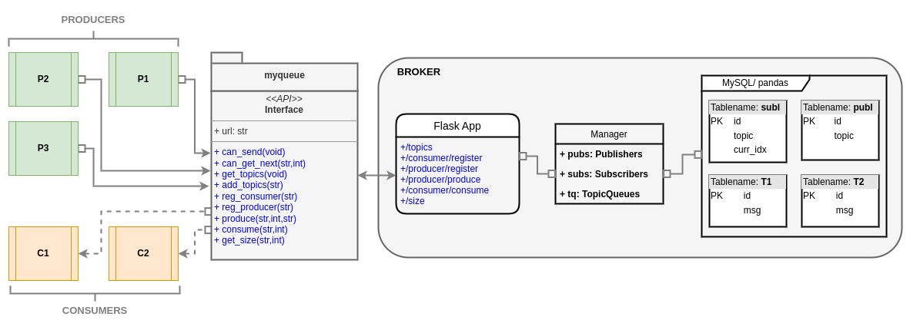
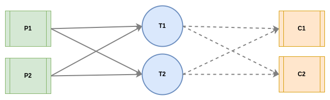
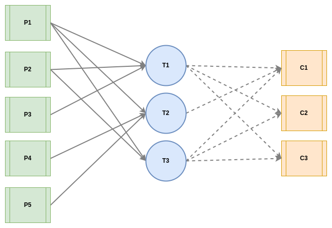

# Distributed Queue

       <strong>Fig.1: Overview</strong>

# Design

The broker implements a distributed logging queue in Python programming language and provides HTTP endpoints to interact with it over the network. It uses the Flask library to register the endpoints and further uses a Manager object to interact with the storage-layer. The storage layer tracks tables for all topics along with subscribers (consumer) and publishers (producer) that are using the broker to pass messages under specific topics. The table schemas are shown in Fig.1.

The Manager object switches the storage-layer from pandas DataFrame (in memory) to mySQL database (persistent) based on a is_SQL flag that can be set while deploying the broker with docker-compose.

On top of the broker, a python library “myqueue” is implemented that provides the MyProducer, MyConsumer classes to easily create respective instances. Moreover an ApiHandler is also implemented to interact with the broker from the python environment. The producer and consumer instances can concurrently send or receive data from the broker. The broker orders the requests and accordingly stores the messages in the storage layer using locking primitives like Semaphore and ThreadPool.

# Assumptions

+ Topics should not have “–” in their name (i.e., T–1 is not allowed, T1 is allowed).
+ “subl” and “publ” names are reserved for the broker's internal use. Hence usage of these two for topic names is prohibited.
+ The log files are of specified format to work with the “myqueue” implementation. This is discussed in detail in the testing phase.
+ Producer and Consumer IDs start from 0 to N for each type of instance. For instance the first producer will have ID as 0 and first consumer will also have ID as 0; however these two are used in different contexts and are not the same.
+ Consumers start consuming messages when they subscribe to a topic. Please note previous messages are not accessible for the consumer instance.
+ Internal ordering of the messages is based on FIFS policy. Hence whichever request comes first, is served first. Unless it is parallelizable (i.e., read calls).

# Challenges

+ Designing the schemas for the tables was a bit challenging. Especially how to design them so that it takes minimum space and it will be easy from the broker’s perspective to interact with the storage-layer.
+ MySQL database supports sequential query processing. Therefore, the concurrent requests from the producer and consumer objects poses a great issue. This leads to multiple failed attempts to test the persistent version of the broker. Eventually, the implementation synchronous Process Pool of size 1 to make the SQL queries sequential.
+ However, the above design choice may increase the latency for each request to be served.

# Prerequisites

### 1. Docker: latest [version 20.10.23, build 7155243]

    sudo apt-get update

    sudo apt-get install \
        ca-certificates \
        curl \
        gnupg \
        lsb-release

    sudo mkdir -p /etc/apt/keyrings
    curl -fsSL https://download.docker.com/linux/ubuntu/gpg | sudo gpg --dearmor -o /etc/apt/keyrings/docker.gpg

    echo \
    "deb [arch=$(dpkg --print-architecture) signed-by=/etc/apt/keyrings/docker.gpg] https://download.docker.com/linux/ubuntu \
    $(lsb_release -cs) stable" | sudo tee /etc/apt/sources.list.d/docker.list > /dev/null

    sudo apt-get update

    sudo apt-get install docker-ce docker-ce-cli containerd.io

### 2. Docker-compose standalone [version v2.15.1]
    sudo curl -SL https://github.com/docker/compose/releases/download/v2.15.1/docker-compose-linux-x86_64 -o /usr/local/bin/docker-compose
    
    sudo chmod +x /usr/local/bin/docker-compose
    
    sudo ln -s /usr/local/bin/docker-compose /usr/bin/docker-compose

# Installation Steps

### Deploy broker 
    persistent mode
    └── sudo docker-compose --env-file ./config/.env.persist up -d

    inMemory mode
    └──sudo docker-compose --env-file ./config/.env.inmem up -d

### Restart broker 
    sudo docker-compose restart

### Remove broker
    sudo docker-compose down --rmi all

# Testing
Here 10.110.10.216:5000 is used as an examle broker instance.

### run a producer instance from log file
    COMMAND
    └──python runproduce.py --id 1 --topics T1 T2 T3 --broker 10.110.10.216:5000 --log_loc ./test/{EXP}

** producer_{id}.txt log file format must be maintained else throws <strong>Exception("log file:incompitable")</strong>

    [ts         msg       parallel    topic]
    ---------------------------------------
    21:52:23	INFO		P1-1		T1
    21:52:23	INFO		P1-1		T2
    21:52:23	INFO		P1-1		T3
    21:52:23	INFO		P1-2		T1
    21:52:23	INFO		P1-2		T2
    21:52:23	INFO		P1-2		T3

### run a consumer instance and store log
    COMMAND
    └──python runconsume.py --id 1 --topics T1 T2 T3 --broker 10.110.10.216:5000 --log_loc ./test/{EXP}

** consumer_{id}.txt stored log file example 

    [ts      msg]
    ---------------------------------------
    T1     INFO
    T2     INFO
    T3     INFO
    T2     WARN
    T1     INFO

### run API test cases
    COMMAND
    └──bash testAPI.sh 10.110.10.216 5000

       <strong>Fig.2: 2 Producers 2 Consumers</strong>

### run 2-producer, 2-consumer setup
Question: Implement 2 Producers and 2 consumers with 2 topics using the library developed in Part-C. Given below is the "topic:producers:consumers" mapping.

+ T1: P1 P2: C1 C2
+ T2: P1 P2: C1 C2

Here, the last point means that P1 and P2 will produce to topic T2;  C1, C2 will consume from T2.

    [Producers]
    └──python runproduce.py --id 1 --topics T1 T2 --broker 10.110.10.216:5000 --log_loc ./test/2P2C
    └──python runproduce.py --id 2 --topics T1 T2 --broker 10.110.10.216:5000 --log_loc ./test/2P2C

    [Consumers]
    └──python runconsume.py --id 1 --topics T1 T2 --broker 10.110.10.216:5000 --log_loc ./test/2P2C
    └──python runconsume.py --id 2 --topics T1 T2 --broker 10.110.10.216:5000 --log_loc ./test/2P2C

    Run all commands together
    -------------------------
    + bash test2P2C.sh 10.110.10.216 5000

** Consumer logs are stored at <strong>./test/2P2C/consumer_{id}.txt</strong> where id = 1,2

       <strong>Fig.3: 5 Producers 3 Consumers</strong>

### run 5-producer, 3-consumer setup
Question: Implement 5 Producers and 3 consumers with 3 topics using the library developed in Part-C. Given below is the "topic:producers:consumers" mapping.

+ T1: P1 P2 P3: C1 C2 C3
+ T2: P1 P4 P5: C1 
+ T3: P1 P2: C1 C2 C3

Here, the last point means that P1 and P2 will produce to topic T3;  C1, C2 and C3 will consume from T3.

    [Producers]
    └──python runproduce.py --id 1 --topics T1 T2 T3 --broker 10.110.10.216:5000 --log_loc ./test/5P3C
    └──python runproduce.py --id 2 --topics T1 T3 --broker 10.110.10.216:5000 --log_loc ./test/5P3C
    └──python runproduce.py --id 3 --topics T1 --broker 10.110.10.216:5000 --log_loc ./test/5P3C
    └──python runproduce.py --id 4 --topics T2 --broker 10.110.10.216:5000 --log_loc ./test/5P3C
    └──python runproduce.py --id 5 --topics T2 --broker 10.110.10.216:5000 --log_loc ./test/5P3C

    [Consumers]
    └──python runconsume.py --id 1 --topics T1 T2 T3 --broker 10.110.10.216:5000 --log_loc ./test/5P3C
    └──python runconsume.py --id 2 --topics T1 T3 --broker 10.110.10.216:5000 --log_loc ./test/5P3C
    └──python runconsume.py --id 3 --topics T1 T3 --broker 10.110.10.216:5000 --log_loc ./test/5P3C

    Run all commands together
    -------------------------
    + bash test5P3C.sh 10.110.10.216 5000

** Consumer logs are stored at <strong>./test/5P3C/consumer_{id}.txt</strong> where id = 1,2,3